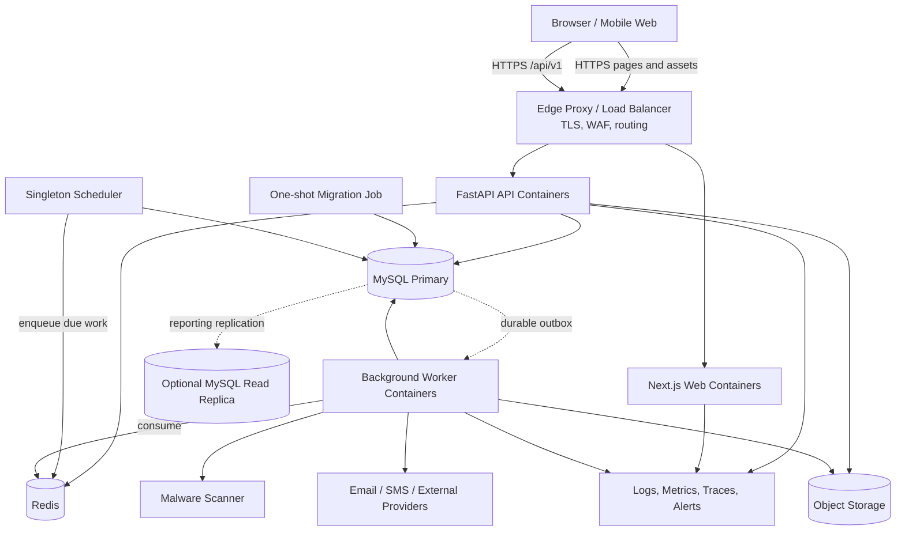
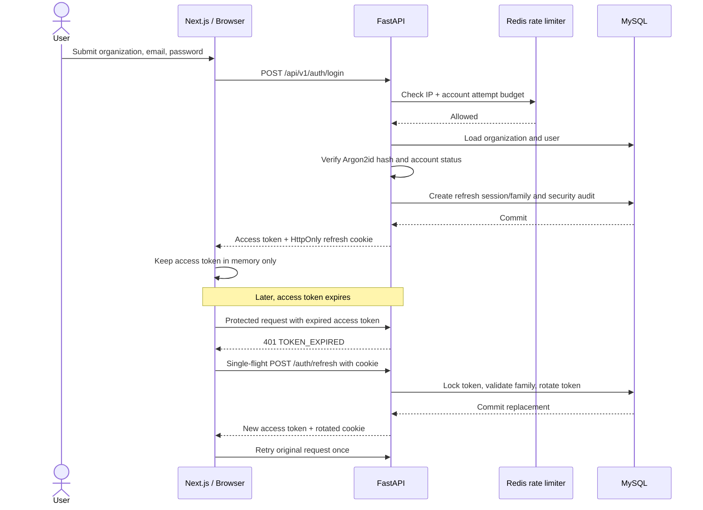
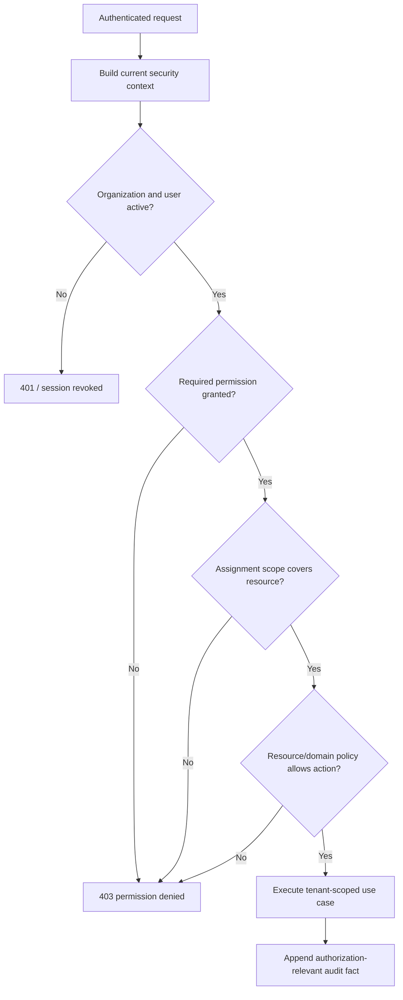
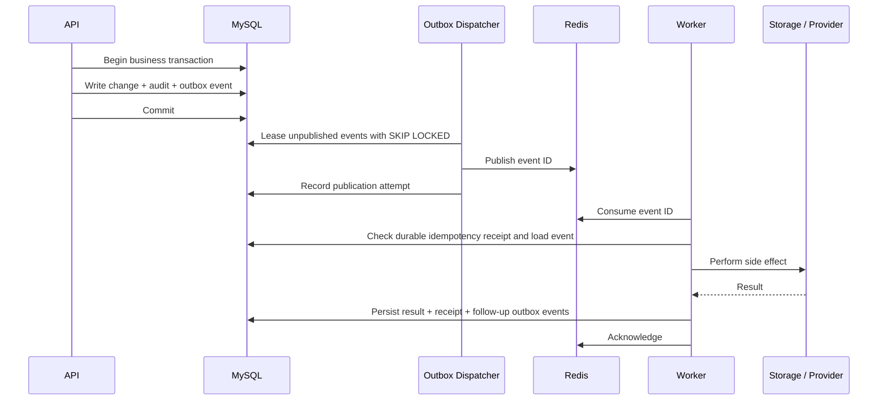
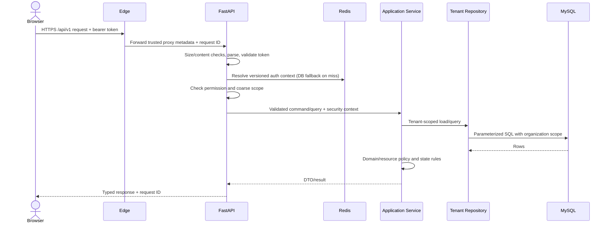
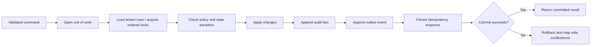

# Production Architecture

Status: target architecture for the Real Estate CRM platform  
Date: 2026-08-20

This document defines the production architecture that future business modules must follow. It does not declare the current Phase 1 repository production-complete, add business modules, or authorize business/default/demo data.

## 1. Architectural principles

1. **Modular monolith first.** Keep one deployable FastAPI codebase with strongly separated domain modules. Split a module into a service only when measured scaling, isolation, or ownership needs justify the operational cost.
2. **MySQL is the system of record.** Redis, search indexes, projections, and object storage references are derived or supporting infrastructure; they never replace transactional truth.
3. **Tenant isolation is enforced repeatedly.** Tenant scope is established from authenticated server-side context, applied in services and repositories, and reinforced with database constraints.
4. **Authorization is deny-by-default.** Frontend visibility improves usability but never grants access. Every protected backend operation evaluates permission and data scope.
5. **Transactions own invariants.** State transitions, unit holds, bookings, payment verification, ledger changes, approvals, audit records, and outbox events commit atomically.
6. **Asynchronous work is durable.** Business transactions write a MySQL outbox record in the same transaction. Redis accelerates delivery but is not the only record that work must occur.
7. **Files are objects; metadata is relational.** MySQL stores ownership, status, checksums, and authorization metadata. File bytes live behind a storage adapter.
8. **APIs are contracts.** REST schemas, error envelopes, pagination, idempotency, concurrency behavior, and versioning are consistent across modules.
9. **Operational behavior is designed in.** Health, logs, metrics, traces, backups, migrations, secret rotation, and recovery are part of the architecture.
10. **No manufactured business data.** Schema migrations may create tables, constraints, indexes, and required technical metadata only. Business records come from authenticated user actions or approved imports.

## 2. Component relationships

Production uses one public HTTPS origin. The edge routes page traffic to Next.js and `/api/*` traffic to FastAPI. This avoids cross-site refresh-cookie behavior and keeps CORS narrow.



### Deployment boundaries

| Component | Responsibility | State |
|---|---|---|
| Edge proxy/load balancer | TLS, WAF, routing, compression, request size ceilings, trusted proxy headers | Stateless |
| Next.js web | Pages, layouts, client bundles, server rendering where useful | Stateless |
| FastAPI API | Validation, authentication, authorization, orchestration, transactional application services | Stateless between requests |
| Migration job | Apply one reviewed Alembic revision chain before application rollout | Ephemeral |
| Worker | Execute idempotent outbox/background handlers | Stateless; checkpoints in MySQL/Redis |
| Scheduler | Discover due durable work and enqueue it; exactly one active scheduler | Stateless leader; schedules persisted |
| MySQL | Transactional source of truth, audit, outbox, file metadata | Durable |
| Redis | Rate limits, caches, distributed coordination, queue transport | Durable where queue usage requires it, but rebuildable |
| Object storage | Uploaded documents and generated artifacts | Durable, versioned/encrypted |

## 3. Frontend architecture

### Target structure

```text
frontend/
├── app/
│   ├── (public)/                 login, onboarding, recovery
│   ├── (app)/                    authenticated layout and future feature routes
│   ├── error.tsx                 route-level safe error UI
│   ├── not-found.tsx
│   └── layout.tsx
├── components/
│   ├── ui/                       accessible design-system primitives
│   ├── layout/                   shell, navigation, page headers
│   └── feedback/                 errors, empty states, skeletons, dialogs
├── features/
│   └── <module>/
│       ├── api/                  feature request functions
│       ├── components/
│       ├── hooks/
│       ├── schemas/              runtime boundary validation
│       ├── types/
│       └── utils/
├── lib/
│   ├── api/                      transport, refresh, retries, errors, cancellation
│   ├── auth/                     session state and permission helpers
│   ├── config/
│   └── observability/
└── tests/                        unit, component, accessibility, end-to-end
```

### Responsibilities

- App Router layouts define public and authenticated navigation boundaries.
- A single API transport owns request IDs, bearer tokens, response parsing, cancellation, one-time refresh/retry, and structured errors.
- The short-lived access token remains in memory. It is never written to local storage, session storage, URLs, or logs.
- A single-flight refresh operation prevents concurrent requests from rotating the same refresh token more than once.
- Route components compose feature modules; they do not contain reusable domain logic or direct raw `fetch` calls.
- Runtime validation protects important API boundaries even when TypeScript types compile.
- Server-rendered pages may fetch non-sensitive shell/configuration data. User-specific business access remains mediated by authenticated API contracts.
- Navigation is derived from effective permissions for usability. Backend policy evaluation remains authoritative.
- Lists use server-side pagination/filtering/sorting. The browser never downloads an entire tenant dataset to filter locally.
- Forms map server validation errors to fields, preserve safe user input, and require confirmation for consequential actions.
- The design system provides consistent tables, filters, form fields, dialogs, toasts, skeletons, empty/error states, keyboard behavior, and focus management.

### Public-origin rule

The canonical production origin is conceptually:

```text
https://crm.example.com/          -> Next.js
https://crm.example.com/api/v1/*  -> FastAPI
```

The API can still use a separate internal hostname. Browser traffic should pass through the public edge. If a deployment deliberately uses unrelated frontend/API sites, cookie `SameSite`, CORS, CSRF, and allowed-origin policies must be redesigned and security-reviewed rather than changed ad hoc.

## 4. Backend architecture

### Target structure

```text
backend/app/
├── main.py
├── api/
│   ├── dependencies.py
│   ├── errors.py
│   └── v1/                       thin HTTP controllers
├── core/                         config, logging, security, tenancy, telemetry
├── domain/
│   ├── shared/                   money, identifiers, transitions, domain errors
│   └── <module>/                 entities, value objects, policies, events
├── application/
│   └── <module>/
│       ├── commands.py           state-changing use cases
│       ├── queries.py            read use cases
│       ├── services.py
│       └── dto.py
├── repositories/
│   ├── protocols.py              domain-facing repository contracts
│   └── sqlalchemy/               tenant-safe implementations
├── db/
│   ├── models/                   ORM models split by module
│   ├── session.py
│   ├── unit_of_work.py
│   └── migrations/
├── permissions/                  permission catalog and policy evaluation
├── workflows/                    explicit state machines and approval execution
├── audit/                        append-only audit service
├── outbox/                       durable event publication
├── tasks/                        worker handlers and scheduler definitions
├── storage/                      local/object adapters and file policy
├── integrations/                 external provider ports/adapters
└── utils/                        narrowly scoped technical helpers
```

### Layer rules

1. **HTTP controllers** validate transport input, resolve dependencies, call one application use case, and map results to response schemas. They contain no SQL or business state transitions.
2. **Application services** establish the transaction boundary, load tenant-scoped objects, invoke domain policies, write audit/outbox records, and commit once.
3. **Domain code** owns allowed transitions, invariants, value objects, and approval policies without importing FastAPI or SQLAlchemy sessions.
4. **Repositories** apply organization scope by construction. A caller cannot accidentally execute an unscoped tenant query through normal repository interfaces.
5. **Infrastructure adapters** implement MySQL, Redis, storage, provider, and queue concerns behind interfaces.
6. **Workers** invoke the same application services or dedicated idempotent task handlers; they do not bypass domain rules.

### Transaction contract

Every consequential command follows this pattern:

```text
begin transaction
  load tenant-scoped aggregates (lock rows when contention is possible)
  validate authorization and current state
  apply domain transition
  persist entity changes
  append audit record
  append outbox event(s)
commit once
```

External network calls never occur inside the database transaction. They are triggered from committed outbox events unless the use case explicitly supports a safe, reversible synchronous call.

## 5. MySQL architecture

### Tenancy model

Use a shared MySQL schema with `organization_id` as the tenant key. This matches the current foundation and provides efficient SaaS operations without creating one database per customer.

The implemented entity inventory, cardinalities, composite tenant foreign keys, and lifecycle
relationships are documented in [docs/ER_RELATIONSHIPS.md](docs/ER_RELATIONSHIPS.md).

Required rules:

- Every tenant-owned table has a non-null `organization_id`.
- Tenant-owned referenced tables expose a unique key on `(organization_id, id)`.
- Cross-table tenant relationships use composite foreign keys such as `(organization_id, project_id)` to prevent cross-organization references at the database layer.
- Unique business keys lead with `organization_id`, for example `(organization_id, code)`.
- Repository APIs receive tenant context from authenticated server state, never from a trusted request body or arbitrary header.
- Global technical tables, if any, are explicitly named and never mixed with tenant-owned rows.

### Schema categories

| Category | Purpose |
|---|---|
| Identity and tenancy | Organizations, branches, departments, users, teams, scoped assignments |
| Authorization | Stable permission catalog, roles, role permissions, user-role scope assignments |
| Domain modules | CRM, inventory, sales, finance, partners, post-sales, rentals, and operations |
| Documents | File metadata, ownership, classification, checksum, scan status, retention |
| Audit | Append-only before/after facts with actor, request, tenant, and timestamp |
| Outbox/jobs | Durable events, idempotency keys, job attempts, schedules, dead letters |
| Reporting projections | Rebuildable denormalized summaries separated from transaction tables |

### Data conventions

- Use `utf8mb4` with a reviewed case/collation policy. Normalize emails/slugs before persistence.
- Store timestamps as UTC `DATETIME(6)` and convert only at presentation boundaries. Define whether fields are server-defaulted or application-supplied; do not mix policies silently.
- Use exact `DECIMAL` types for money and area. Store currency explicitly when more than one currency is possible. Never use floating point for financial values.
- Use string status codes or lookup-backed technical metadata with explicit application state machines; never rely on display labels.
- Master data may use carefully controlled soft deletion when history requires it. Financial, audit, and approval transactions are reversed/superseded, not overwritten or hard-deleted.
- PII fields are classified. Highly sensitive values are encrypted at the application layer with versioned keys from a secrets/KMS system and are masked in logs and responses.
- JSON is reserved for flexible metadata, snapshots, and provider payloads. Query-critical business fields remain typed columns.

### Index and scaling strategy

- Tenant queries use indexes beginning with `organization_id`, followed by high-selectivity filter/sort fields.
- Indexes are justified from query plans and production-like cardinality, not added to every column.
- Write paths use short transactions and deterministic lock ordering.
- Contended inventory/booking operations use `SELECT ... FOR UPDATE`, explicit transition checks, and unique invariants/idempotency records.
- Read replicas may serve reports that tolerate replication lag. Authorization and transaction decisions always use the primary.
- Reporting tables and archived audit/history data can be partitioned or moved only after measured need. `organization_id` remains the future sharding key.

### Migration policy

- Alembic revisions contain explicit, reviewable operations and never call live `Base.metadata.create_all()`.
- Migrations are immutable after release.
- Expansion and contraction are separate for zero-downtime changes: add compatible schema, deploy compatible code, backfill asynchronously, then remove old schema later.
- A one-shot migration job runs before API/worker rollout. Application replicas never race to migrate on startup.
- CI applies every migration from an empty MySQL database and upgrades a representative previous schema.
- Migrations insert no business records. Required permission definitions or other technical metadata must be explicitly classified, versioned, and documented.

## 6. Authentication architecture

### Credentials and sessions

- Passwords are hashed with Argon2id using centrally configured, periodically reviewed parameters.
- Password normalization is avoided; length and strength rules are validated without silently changing the secret.
- Login responses do not reveal whether the organization, email, or password was incorrect.
- Login attempts are rate limited by trusted client IP and normalized account key. Escalating delays and security events protect against credential stuffing.
- Optional MFA and recovery methods attach to the session architecture without changing business authorization semantics.

### Access token

The access token is short lived (normally 10–15 minutes) and signed using a rotatable production key. Prefer an asymmetric algorithm with a key identifier when multiple services will validate tokens; a strong, rotated symmetric key is acceptable while FastAPI is the only issuer/verifier.

Required claims:

| Claim | Meaning |
|---|---|
| `iss`, `aud` | Expected issuer and audience |
| `sub` | User identifier |
| `org` | Organization identifier |
| `sid` | Server-side session/family identifier |
| `av` | Authorization/account version for invalidation |
| `jti` | Unique token identifier |
| `iat`, `nbf`, `exp` | Issue, validity, and expiry timestamps |

The access token is stored only in browser memory. Sensitive permissions or PII are not embedded in it.

### Refresh token

- Refresh tokens are high-entropy opaque values.
- The browser receives the token in a host-only `Secure`, `HttpOnly`, `SameSite=Lax` cookie. Production uses HTTPS only.
- MySQL stores only a cryptographic digest, session family, user/tenant, issue/expiry times, absolute family expiry, revocation state, replacement link, and security metadata.
- Every refresh rotates the token inside a row-locked transaction.
- Reuse of a revoked predecessor revokes the entire family and emits a security audit event.
- Sessions have both idle and absolute lifetimes. Rotation never extends beyond absolute expiry.
- Logout revokes the current family or current device session according to the requested operation.

### CSRF and origin policy

Bearer-authenticated business requests are not automatically credentialed by the browser and therefore are not cookie-CSRF targets. Cookie-based refresh/logout endpoints enforce allowed `Origin`/`Referer`, same-origin routing, allowed content types, and a CSRF token if the deployment threat model requires it. CORS never uses wildcard origins with credentials.

### Authentication flow



### Password lifecycle and recovery

- `POST /auth/change-password` requires a valid bearer session and the current password. Success
  increments `User.auth_version`, revokes every refresh family for that user, consumes pending
  reset tokens, and requires a fresh login.
- `POST /auth/forgot-password` always returns the same `202` response. For an active matching
  account it stores only a digest of a high-entropy, single-use token and sends the raw token through
  the configured SMTP adapter after the database commit.
- Reset links place the token in the URL fragment, keeping it out of reverse-proxy/frontend-server
  request logs and Referer headers. The browser removes the fragment before submitting the token to
  `POST /auth/reset-password`.
- A successful reset changes the Argon2id hash, increments the account authorization version,
  revokes all sessions, consumes every outstanding reset token, and writes an audit fact.
- Staging and production configuration fails at startup unless reset delivery uses SMTP and the
  public web URL uses HTTPS. Reset tokens are never returned by the API or written to logs.

### Implemented authentication endpoints

| Endpoint | Authentication | Result |
| --- | --- | --- |
| `POST /auth/register-organization` | Public, rate limited | Intended setup creates the real first user and an authenticated session |
| `POST /auth/login` | Public, rate limited | Access token response and HttpOnly refresh cookie |
| `POST /auth/refresh` | Refresh cookie, origin checked | Rotated refresh cookie and replacement access token |
| `POST /auth/logout` | Refresh cookie, origin checked | Revokes the current session family and clears the cookie |
| `GET /auth/me` | Bearer access token | Current active user, organization, and effective permissions |
| `POST /auth/change-password` | Bearer access token | Changes password and revokes every session |
| `POST /auth/forgot-password` | Public, rate limited | Non-enumerating recovery acknowledgement |
| `POST /auth/reset-password` | One-time reset token | Changes password and revokes every session |

## 7. RBAC architecture

RBAC controls what a user may do; data scope controls where they may do it. Both must pass.

### Core concepts

- **Permission:** stable technical code such as `users.read` or `bookings.approve`.
- **Role:** organization-configurable set of permissions.
- **Assignment:** association of a user to a role and optional scope.
- **Scope:** organization, branch, department, project, team, assigned-user, or self.
- **Resource policy:** module-specific ownership/status rule evaluated after permission and scope.

The 15 primary product roles are configurable templates, not hardcoded authorization branches. An organization may adopt and customize templates through an explicit onboarding/administrative action. The system does not create demo users or business records.

### Evaluation contract



### Implementation rules

- Route dependencies declare coarse required permissions; application services repeat the policy at the use-case boundary where necessary.
- Resource queries include tenant and visibility scope, so unauthorized rows are not loaded and filtered afterward.
- Permission assignments and authorization version changes are audited.
- Redis may cache an effective permission set keyed by `(organization_id, user_id, authorization_version)`. Role/assignment changes increment the version and invalidate old keys.
- Cache loss falls back to MySQL; stale permissions must not survive a version change.
- “Administrator” is a role with explicit permissions, not a bypass hidden in code.
- Service accounts, customers, brokers, and tenants use the same deny-by-default policy engine with role-appropriate scopes.

## 8. File storage architecture

### Storage layers

```text
Application file service
  ├── Storage interface
  │   ├── Local adapter (development only)
  │   └── Object-storage adapter (production)
  ├── File policy (size, MIME, extension, classification)
  ├── MySQL file metadata repository
  ├── Malware scanner integration
  └── Retention/audit service
```

Production objects use encrypted private buckets/containers with versioning, lifecycle rules, and blocked public access. Object keys are generated by the server and include opaque tenant/entity partitions; user-provided filenames are metadata only and never form trusted paths.

### File metadata lifecycle

Recommended states are technical workflow metadata, not seeded business data:

```text
PENDING_UPLOAD -> UPLOADED -> SCANNING -> AVAILABLE
                               └-------> QUARANTINED / REJECTED
AVAILABLE -> DELETED / RETENTION_HOLD
```

### File upload flow

```mermaid
sequenceDiagram
    actor User
    participant Web
    participant API
    participant DB as MySQL
    participant Store as Object Storage
    participant Queue as Redis Queue
    participant Worker
    participant Scan as Malware Scanner

    User->>Web: Select file
    Web->>API: Request upload intent (name, size, declared MIME, entity)
    API->>API: Authenticate, authorize, validate policy and entity ownership
    API->>DB: Create PENDING_UPLOAD metadata with opaque object key
    DB-->>API: Commit upload record
    API-->>Web: Short-lived signed upload instruction
    Web->>Store: Upload bytes directly
    Web->>API: Finalize upload with checksum/size
    API->>Store: Verify object metadata
    API->>DB: Mark UPLOADED and append outbox event
    API-->>Web: 202 Accepted
    Worker->>DB: Claim file-scan outbox task
    Worker->>Store: Stream object safely
    Worker->>Scan: Scan and inspect actual content signature
    Scan-->>Worker: Clean or rejected
    Worker->>DB: Mark AVAILABLE or QUARANTINED; append audit/event
```

Downloads require a fresh authorization check and return either a short-lived signed URL or an API-streamed response for highly sensitive files. Quarantined/pending objects are never downloadable through business APIs.

## 9. Redis architecture

Redis is divided by explicit key namespaces and, in production, preferably separate managed instances/clusters for cache/rate limiting and queue workloads when failure domains warrant it.

| Namespace/use | Example purpose | Source of truth | Failure behavior |
|---|---|---|---|
| `rate:*` | Login, refresh, upload, and expensive endpoint budgets | Redis window/token bucket | Sensitive endpoints fail closed or use a bounded local fallback |
| `authz:*` | Versioned effective permission cache | MySQL RBAC tables | Fall back to primary MySQL |
| `cache:*` | Safe dashboard/reference projections | MySQL | Miss and rebuild; never return cross-tenant keys |
| `lock:*` | Short coordination locks and scheduler leadership | MySQL invariants remain final authority | Retry or defer; never treat lock as the sole invariant |
| `queue:*` | Ready background work | MySQL outbox/job record | Re-publish unacknowledged work |
| `dedupe:*` | Short-lived request/job deduplication accelerator | MySQL idempotency record for consequential writes | Fall back to database check |

Rules:

- Every tenant cache key contains the organization identifier.
- Values have bounded TTLs and versioned serialization.
- Redis credentials/TLS come from the secret/config system; Redis is not publicly exposed.
- Queue consumers acknowledge only after durable handler state is committed.
- Memory limits and eviction policy are explicit. Queue data is never placed in an eviction-prone cache instance without durable outbox recovery.
- Rate limiting uses an atomic Lua script or equivalent rather than separate race-prone operations.

## 10. Background-job architecture

### Durable outbox

API transactions insert an `outbox_events` row alongside the business/audit change. A dispatcher claims unpublished rows using short leases and `SKIP LOCKED`, publishes work to Redis, and marks publication status. A reconciliation loop republishes expired/unconfirmed leases.

Each event contains:

- event ID and schema version
- organization ID
- aggregate type and ID
- event type
- occurred timestamp
- minimal payload/reference, excluding unnecessary sensitive data
- correlation/request ID and actor ID where relevant
- attempt/availability metadata

### Worker rules

- Handlers are idempotent using the event/job ID and a durable MySQL idempotency/receipt record.
- Retries use bounded exponential backoff with jitter and error classification.
- Permanent failures move to a dead-letter state with operator visibility; they are not discarded.
- Jobs carry tenant context but never trust tenant fields without validating referenced records.
- Long-running jobs heartbeat their lease and support safe cancellation at checkpoints.
- External-provider results and provider IDs are persisted before acknowledgement.
- Scheduler jobs store schedules and next-run state durably. A Redis leader lock prevents duplicate discovery, while handler idempotency protects against duplicates anyway.
- Workers use the same permission-independent domain invariants as API commands. System-initiated actions use an explicit system actor and audit identity.

### Background-job flow



## 11. Docker architecture

### Development Compose

Docker Compose remains the reproducible local topology:

- `mysql`
- `redis`
- `migration` one-shot service
- `backend`
- `worker`
- `scheduler`
- `frontend`
- optional local object-storage/scanner profiles

Local development may expose database/cache ports explicitly. It must still use an empty business database unless developers enter or import test data intentionally in isolated test environments.

### Production containers

- Build images from locked dependencies with `npm ci` and a locked Python dependency graph.
- Run as non-root with a read-only root filesystem and writable mounts only where required.
- Use the same backend image for API, worker, scheduler, and migration processes with different commands.
- Do not bake secrets into images, layers, build arguments, or public Next.js variables.
- Pin base images to reviewed versions/digests and scan images in CI.
- Expose only edge ingress publicly. MySQL, Redis, storage, workers, and internal API ports stay on private networks.
- Define liveness, readiness, and startup probes for web/API/worker processes.
- Set CPU/memory limits, graceful shutdown deadlines, connection pool budgets, log limits, and replica counts.
- Run migrations as an explicit release step before rolling out compatible API/workers.
- Prefer managed MySQL, Redis, and object storage in production. Compose is not the production orchestrator or high-availability mechanism.

### Network zones

```text
public:    edge only
web:       edge <-> frontend, edge <-> API
service:   API/worker/scheduler <-> Redis/object-provider endpoints
data:      API/worker/migration <-> MySQL
```

## 12. API architecture

### REST conventions

- Base path: `/api/v1`.
- Resource nouns are plural; workflow commands use explicit subresources/actions only when they are not natural CRUD operations.
- Pydantic schemas define request and response contracts. ORM objects are not returned directly.
- OpenAPI is generated from the same contracts; production documentation exposure is separately controlled.
- All timestamps are ISO 8601 UTC. Monetary amounts are strings/decimal-safe JSON values with currency where applicable.
- IDs are opaque; clients do not infer tenant or entity semantics from them.
- Unknown fields are rejected for consequential commands where silent acceptance would be risky.

### Request metadata

| Header | Purpose |
|---|---|
| `Authorization: Bearer ...` | Short-lived access token |
| `X-Request-ID` | Optional caller correlation ID; server validates/limits or creates one |
| `Idempotency-Key` | Required for selected consequential create/command endpoints |
| `If-Match` | Optimistic concurrency for safely versioned resources |
| `Accept-Language` | Presentation preference only; stored data remains locale-neutral |

The organization is derived from authenticated context. A client-provided organization header or body field is never trusted to establish access.

### Standard response behavior

- `200` successful read/update with a body.
- `201` successful resource creation.
- `202` durable asynchronous work accepted.
- `204` successful operation without a body.
- `400` malformed request semantics, `401` unauthenticated/expired session, `403` unauthorized, `404` absent or deliberately concealed resource, `409` state/uniqueness conflict, `412` version mismatch, `422` field validation, `429` rate limit, and `503` unavailable dependency.

Errors use one envelope:

```json
{
  "error": {
    "code": "STABLE_MACHINE_CODE",
    "message": "Safe user-facing summary",
    "details": [],
    "request_id": "correlation-id"
  }
}
```

Sensitive stack traces, SQL, tokens, internal paths, secrets, and provider payloads are never returned.

### Collection and concurrency contracts

- Collection endpoints use bounded cursor pagination by default and return `items` plus `page.next_cursor`.
- Filters and sort fields are explicit allowlists. Search inputs are length-limited and parameterized.
- Expensive exports run asynchronously and produce authorized, expiring file artifacts.
- Idempotency keys are tenant/user/operation scoped, store a request fingerprint, and replay the original safe response. Reusing a key with a different payload is a conflict.
- Resource versions or ETags protect ordinary concurrent edits.
- Database locks and unique invariants protect high-contention workflows; HTTP optimistic concurrency alone is insufficient for unit booking or financial posting.

## 13. End-to-end flows

### Standard authenticated request flow



### Authorization flow

1. Validate token signature, issuer, audience, time claims, type, and session identifiers.
2. Load active user/organization/session security context using the token's `sub`, `org`, `sid`, and authorization version.
3. Resolve effective permissions and assignments from versioned cache or MySQL.
4. Confirm the endpoint permission.
5. Restrict the repository query to allowed organization/branch/department/project/team/user scope.
6. Evaluate ownership, status, separation-of-duty, and approval policy on the loaded resource.
7. Execute or return a safe `401`, `403`, or concealed `404` according to policy.
8. Audit consequential allowed operations and security-relevant denials.

### Database command flow



Queries use a read-only session/transaction where useful, select only required columns, apply tenant/visibility filters before pagination, and never trigger writes implicitly.

## 14. Cross-cutting production requirements

### Observability

- Structured JSON logs include request/correlation ID, tenant ID, actor ID, route/operation, status, latency, and safe error code.
- Metrics cover request rates/latency/errors, connection pools, Redis operations, outbox lag, queue depth, retries/dead letters, file scans, and provider outcomes.
- Distributed traces connect edge, API, MySQL/Redis calls, outbox dispatch, workers, and external providers without recording secrets or sensitive document contents.
- Alerts use service-level symptoms and durable-work lag, not only container CPU.

### Reliability and recovery

- MySQL uses automated encrypted backups with point-in-time recovery and regularly tested restores.
- Object storage uses versioning/lifecycle policies appropriate to document retention.
- Redis queue recovery is proven from the MySQL outbox.
- Deployments support graceful drain and backward-compatible rolling updates.
- Runbooks cover compromised sessions/keys, failed migrations, provider outages, queue backlog, storage quarantine, and tenant data incidents.

### Testing gates

Before a module is releasable, CI must run:

- formatting, linting, and strict type checks
- unit and domain state-machine tests
- API contract and authorization tests
- tenant-isolation and cross-tenant negative tests
- Alembic upgrade tests on MySQL
- concurrency/idempotency tests for contended commands
- frontend component/accessibility tests
- end-to-end critical-path tests
- dependency, secret, SAST, and container vulnerability scans

## 15. Business-module integration contract

Future business modules plug into this architecture only after defining:

1. entities, ownership, tenant relationships, and composite constraints
2. permission codes and assignment scopes
3. commands, queries, state transitions, and invariants
4. transaction, locking, idempotency, audit, and outbox behavior
5. REST schemas, filters, pagination, errors, and versioning
6. frontend routes, permission-aware navigation, forms, tables, and states
7. file classifications and background tasks, if applicable
8. unit, MySQL integration, authorization, concurrency, frontend, and end-to-end tests

This contract is architecture only. It creates no roles, users, customers, leads, projects, inventory, bookings, payments, reports, statistics, notifications, or other business data.
