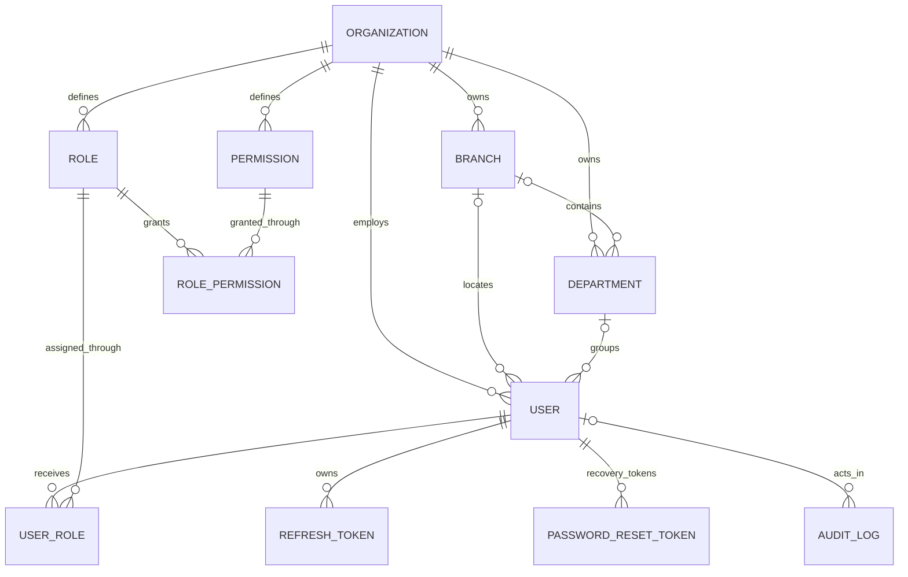
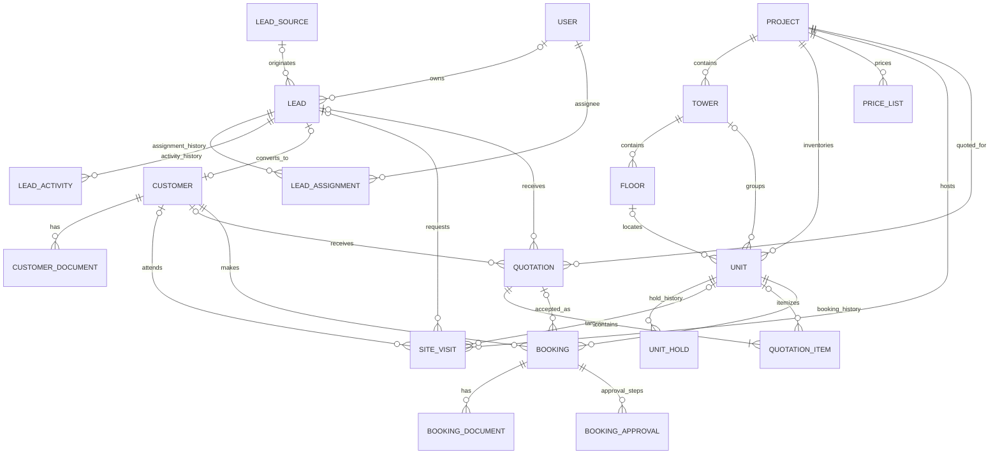
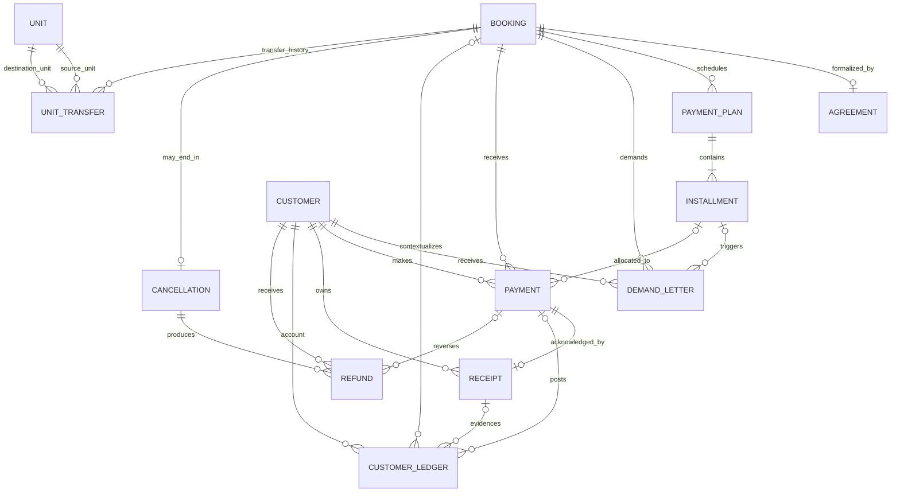
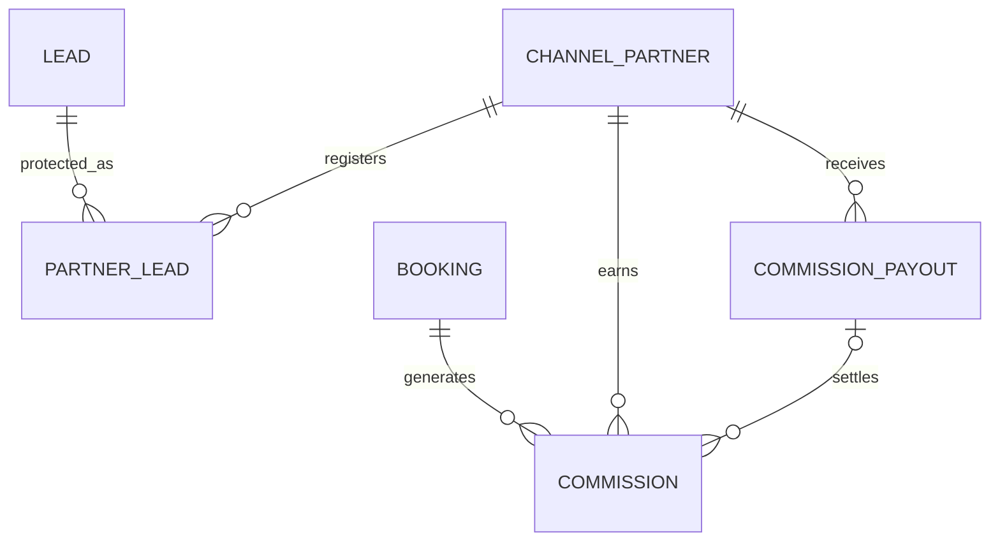
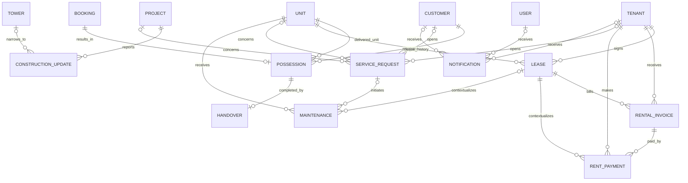

# Real Estate CRM ER Relationships

## Scope

This document describes the production database foundation implemented by Alembic revision
`20260821_0001`. The schema contains structure only: migrations insert no organizations, users,
roles, permissions, business records, or demo data.

The logical entity name `CustomerLedger` is stored as `customer_ledger_entries`, and `Maintenance`
is stored as `maintenance_records`. `UserRole` and `RefreshToken` are authentication support
entities in addition to the entities requested for the CRM foundation.

## Tenant and key conventions

- IDs are application-generated UUID strings (`VARCHAR(36)`).
- Every tenant-owned table has a non-null `organization_id`.
- Every tenant-owned table exposes a unique `(organization_id, id)` candidate key.
- Domain foreign keys contain both `organization_id` and the referenced ID. The database therefore
  rejects a reference to an entity in another organization even if application filtering fails.
- Organization slugs are globally unique. Business numbers, codes, and natural keys are unique
  inside an organization unless otherwise noted.
- Mutable entities have `created_at` and `updated_at`. `AuditLog` is append-only in shape and has
  `created_at` only.
- Monetary values use fixed precision decimals and carry an ISO-style three-character currency
  column. The schema does not assume a default currency.
- Status and type fields are constrained string enums, keeping values portable and readable in
  MySQL.

## Organization, identity, and RBAC

`UserRole` is unique per organization/user/role. `RolePermission` is unique per
organization/role/permission. The schema creates no role or permission records; authentication
bootstrap behavior remains an application concern.

`User.auth_version` invalidates issued access tokens after a password or authorization-sensitive
account change. Refresh-token rows store idle and absolute expiration boundaries. Password-reset
tokens are opaque to the database (only SHA-256 digests are stored), expire quickly, and are
consumed as a set when one reset succeeds.

## CRM, inventory, and sales

Site visits and quotations require a lead or a customer. A customer can retain the lead from which
it was converted. `active_lead_key`, `active_unit_key` on holds, and `active_unit_key` on bookings
are nullable MySQL uniqueness keys: the transaction service sets them to the protected entity ID
while the record is active and clears them when the record becomes historical. This enforces one
active assignment/hold/booking per protected entity without relying on partial indexes, which
MySQL does not provide.

`PriceList.pricing_rules` stores a versioned pricing rule document for a project. It does not copy
unit prices into business data or create price-list rows automatically.

## Booking finance and customer accounting

Payment and ledger idempotency keys are unique within an organization. Positive/non-negative
amount checks guard financial rows, while service transactions remain responsible for balancing a
payment plan, allocating payments, and posting immutable ledger entries atomically. A unit transfer
cannot use the same source and destination unit.

## Partners and commissions

A partner/lead registration and a partner/booking commission are each unique inside an
organization. A payout groups zero or more approved commissions and records its own amount,
currency, status, reference, approver, and payment time.

## Post-sales, rental, and operations

Construction progress is constrained to 0–100 percent. A possession is unique per booking and a
handover is unique per possession. Leases use the same nullable active-unit uniqueness technique
as bookings and holds. Rental invoices are unique per lease and billing period, and rent-payment
idempotency keys prevent duplicate provider callbacks.

A service request requires either a customer or tenant requester. Notification rows require at
least one recipient. Notification related-entity fields and audit-log entity fields are deliberately
polymorphic and therefore are not foreign keys; this allows immutable historical references even
after domain-specific lifecycle changes.

## Delete behavior and lifecycle rules

- Deleting an organization cascades to its tenant-owned rows at the database boundary. Production
  workflows should normally deactivate organizations rather than physically delete them.
- Strong ownership children such as quotation items, booking documents, role grants, and lead
  activity history may cascade with their parent.
- Financial, booking, inventory, possession, partner, and audit references use restrictive deletes
  so records must be archived or transitioned instead of silently losing history.
- Nullable references do not weaken tenant isolation; their composite foreign key is simply not
  evaluated while the referenced ID is null.
- Status-transition validity, ledger balancing, hold expiry, approval ordering, and active-key
  maintenance belong in transactional domain services and background jobs. Those business modules
  are intentionally outside this database-foundation phase.

## Relationship summary

| Domain root | Principal dependents | Key cardinality/invariant |
| --- | --- | --- |
| Organization | All tenant tables | One organization owns every tenant row |
| User | assignments, approvals, audit, notifications | Optional actor/assignee; RBAC via join tables |
| Lead | activities, assignments, partner registrations | One lead may convert to at most one customer |
| Project | towers, units, price lists, construction updates | Codes unique per organization/project scope |
| Unit | holds, bookings, leases, transfers, maintenance | At most one active hold/booking/lease key per organization |
| Customer | documents, bookings, finance, possession | All finance references remain tenant-scoped |
| Booking | approvals, agreement, plans, payments, lifecycle | One agreement/possession/cancellation per booking |
| Payment plan | installments | Installment sequence unique within a plan |
| Payment | receipt, ledger, refund | At most one receipt per payment; idempotent payment intake |
| Channel partner | protected leads, commissions, payouts | Commission unique per partner and booking |
| Lease | rental invoices, payments, maintenance | Invoice period unique within a lease |
| Service request | maintenance | Requester required; maintenance link optional |
